本科学的通信读研了没在做，也算是出于兴趣完成的工程，难免有纰漏，后续会抽空将本工程逐渐完善。若有任何问题，非常欢迎您通过邮箱联系我lauchinyuan@yeah.net，共同探讨学习，不过近来比较忙，回复可能稍慢，见谅。

### 重要更新说明

- 2023.11.02： 之前提到，在程序烧到FPGA板子后会出现少量解调数据错误的问题，在与某位小伙伴交流的过程中， 发现在[解调器](./rtl/qpsk_demod.v)中产生解调端载波时，将鉴相器产生的相位误差信号`phase_error`传给了载波发生器模块`dds_demo_sin_inst`和`dds_demo_cos_inst`的相位控制字接口，导致载波发生器模块产生的信号`carry_sin`、`carry_cos`有了不稳定的相偏，影响了解调效果，目前还是在同一FPGA板子上进行同频同相的调制解调，故不需动态调制相偏。通过将这一控制字改为0，并进行实验，**数码管显示的时钟数据不再出错，Bug成功修复**，新的实验效果请见[Youtube](https://youtu.be/pUp5kpjEX7Y)。

- 2023.08.31：有伙伴询问了有关本项目中IP核配置参数细节，现将本工程的IP核配置文件存于[xci](./xci)文件夹中，在vivado中作为source文件添加即可完成对IP core的配置。若出现"IP is locked"提示，点击vivado上方Reports -> Report IP Status，更新IP core即可，**此外需注意更改FIR滤波器配置时用到的coe文件的文件路径**。

  若您暂无vivado，需要查看有关IP core的配置信息，可以查看[ip_core_config](./ip_core_config)文件夹，内含以图片方式保存的IP核配置信息，由于近来较忙，先不对其展开说明，以后再说(🕊)。

### 关于本项目

本项目是使用Verilog硬件描述语言编写的可以部署在FPGA平台上的正交相移键控（Quadrature Phase Shift Keying，QPSK）调制解调器，使用的调制方案为IQ正交调制，解调端使用Gardner环实现位同步，costas环载波同步暂未实现，仍在测试中。采用了vivado IP核实现FIR滤波器、乘法器、DDS直接数字频率合成器，这些IP核可以用quartus IP核或者其他厂商提供的IP来替代，系统功能演示视频参见[Youtube](https://youtu.be/pUp5kpjEX7Y)，MATLAB基本仿真程序在本工程[matlab](./matlab)文件夹中。

#### 功能说明

整体功能为发送端产生时分秒时钟数据，并将这一数据封装成带有帧头和校验和的数据帧，每一个数据帧设定为40bit，即帧头(8bit)+时(8bit)+分(8bit)+秒(8bit)+校验和(8bit)，通过QPSK调制器将这一数据调制成QPSK信号。接收端接受这一信号，并进行载波同步和位同步，抽样判决得到解调后的二进制数据，最后解析这一数据，在接收端实现时钟数据的数码管动态显示。本项目的核心为QPSK调制解调器，具体传送的数据可以自定义，并不一定是时钟数据。

#### 模块结构

本工程RTL视图如图1所示

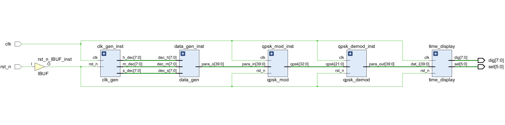

图1. RTL视图

各个模块的功能解释如下：

- clk_gen:时钟生成模块，产生时分秒时钟信号，用于后续生成40bit原始数据，在设计中每秒更新一次数据。
- data_gen:数据生成模块，结合所设定的帧头，时钟数据，计算校验和，并生成40bit数据
- qpsk_mod:调制模块，其主要子模块有
  - para2ser:将40bit并行数据转换为串行数据流，在本设计中高位先发
  - iq_div:将串行数据流依据其奇偶位置，分为I(正交)、Q(同向)两路
  - rcosfilter:升余弦滤波器，使用FIR滤波器实现，对I、Q两路数据进行成形滤波
  - dds:直接数字频率合成信号发生器，产生正弦、余弦载波
- qpsk_demod:解调模块，其主要子模块有
  - gardner_sync:Gardner环，用于实现位同步，判断最佳的抽样判决点，并进行抽样判决，输出抽判数据，gardner环主要的子模块有：
    - interpolate_filter:内插滤波器，计算内插值
    - gardner_ted:Gardner:定时误差检测，包含环形滤波器
    - nco：nco递减计数模块，生成抽样判决标志信号
  - dds:直接数字频率合成信号发生器，产生正弦、余弦载波
  - iq_comb:将抽样判决后的I、Q两路数据重新整合成一路串行数据输出
  - data_valid:数据有效性检测模块，检测帧头和校验和是否正确，若正确，输出最终的40bit数据结果
- time_display:时钟数据显示模块，依据收到的40bit数据，解析时钟信息，并在数码管上显示，对数据个位和十位的分离，采用了bcd编码方案。

### 设计思路

#### QPSK基本原理

QPSK全称为正交相移键控（Quadrature Phase Shift Keying），简单来说就是利用四种不同的相位来代表不同的信息的数字调制解调技术。其信号表示为：

$$S_i(t) = Acos(\omega_ct+\theta_i),i=0,1,2,3$$

有关QPSK的详细原理在此先不赘述，相关内容可见[wikipedia](https://en.wikipedia.org/wiki/Phase-shift_keying#Quadrature_phase-shift_keying_.28QPSK.29)。

#### MATLAB仿真及参数设定

在整体QPSK调制解调过程中，存在成型滤波、低通滤波等滤波过程，这些滤波器参数的设置影响了QPSK调制解调的性能，同时，QPSK的码元速率、载波频率等因素也会影响到通信质量。所以在编写Verilog代码前，通过编写MATLAB仿真程序，对QPSK调制解调的基本过程进行仿真，以确认相关参数的设计的正确性。

通过MATLAB仿真和实际功能需求，确定本设计的相关参数如下：

- 码元速率：5Kbit/s

- 调制端载波频率：50kHz

- 帧长度：40bit

- 采样率：500kHz

- 成形滤波器
  
  - 滚降系数：0.5
  
  - 截止频率：2kHz
  - FIR阶数：40阶
  
- 低通滤波器
  - 截止频率：8kHz
  - FIR阶数：30阶

综上，每秒可以传送的帧数为：

$$N_f =500000 \div (40\times 100)=125$$

#### 调制端设计

对于调制过程，其结构如图2所示：

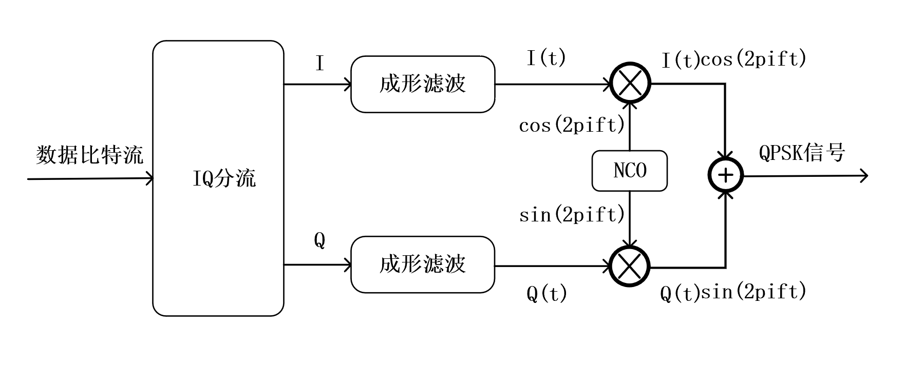

图2. QPSK调制器结构

将I、Q两路数据流转换为双极性信号(+1/-1)，分别与余弦信号、正弦信号相乘，然后再相加，得到的信号表达式为：

$$S_i(t)=Icos(\omega_ct)+Qsin(\omega_ct)$$

得到的信号与I、Q两路双极性数据之间的对应关系如表1所示，即通过两路同频的正余弦载波信号的相加可以实现混合信号的四个不同相位。

 表1. I、Q数据与QPSK调制信号的映射

$$
\begin{array}{|c|c|c|}
\hline
{I} & {Q} & {S_i(t)}  \\
\hline
{+1} & {-1} & {\sqrt{2}cos(\omega_ct+\pi/4)} \\
\hline
{-1} & {-1} & {\sqrt{2}cos(\omega_ct+3\pi/4)} \\
\hline
{-1} & {+1} & {\sqrt{2}cos(\omega_ct+5\pi/4)} \\
\hline
{+1} & {+1} & {\sqrt{2}cos(\omega_ct+7\pi/4)} \\
\hline
\end{array}
$$

##### IQ分流

输入的原始数据流的每一bit是具有确定周期(本设计中为0.2ms)的比特流，QPSK调制过程需要将这些bit流依据其所在位置分为I(正交)、Q(同向)两路，在RTL设计中，依据所用的采样时钟频率(本设计中为500kHz)配置计数器，每一个采样时钟自加1，当计数器计数一定次数(本设计中为100次)，即完成一个通道一个bit的采样，接着继续采样，但将采样数据输出到另一通道，并重新开始计数，往复循环。在FPGA实现中，IQ分流模块和产生数据流的data_gen模块的复位信号`rst_n`是同一个信号，在理想条件下，两个模块同时离开复位模式，开启正常工作，故可以确保IQ分流模块的计数器是从数据边沿开始计数，计到100正好需要转换数据通道。

##### 成形滤波

QPSK调制过程中的关键部件是成形滤波器，成形滤波的作用是平滑波形效果，提高频谱的利用率，并消除码间串扰。

本设计中成型滤波为平方根升余弦低通FIR滤波器。通过MATLAB Filter Designer工具，配置相应的滤波器参数(如滤波器阶数，窗函数等)可以生成滤波器抽头系数，将生成的抽头系数文件(例如Vivado支持的coe文件)导入到FIR滤波器IP核，并配置相应的IP核参数，即可实例化调用相应IP实现成形滤波器。对于本设计中的其他滤波器也是同样的设计思路。

##### 数字上变频

依照表1中的式子，将成形滤波后的I、Q两路数据与分别与余弦、正弦载波相乘，将基带信号调制到中频，并将相乘后两路信号叠加，即可得到中频的QPSK调制信号，本设计中乘法器使用vivado提供的乘法器IP核实现。

#### 解调端设计

对于解调过程，其结构如图3所示。

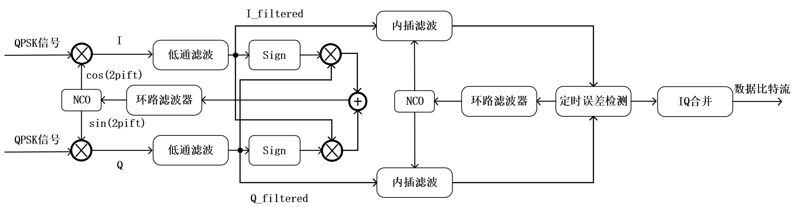

图3. QPSK解调器结构

##### 数字下变频

QPSK解调器接收到ADC采集的信号后，首先要进行数字下变频，即对接收的中频信号进行频谱搬移，使其恢复为低频信号，假设QPSK信号为：

$$QPSK(t)=cos(\omega_0t+\theta)$$

在QPSK解调端分别乘以正余弦载波后，有

$$I(t)=QPSK(t)cos(\omega_0t+\phi)=\frac{1}{2}[cos(\phi-\theta)+cos(2\omega_0t+\phi+\theta)]$$

$$Q(t)=QPSK(t)sin(\omega_0t+\phi)=\frac{1}{2}[sin(\phi-\theta)+sin(2\omega_0t+\phi+\theta)]$$

通过低通滤波器滤除二倍频率分量后，即得到低频分量，实现下变频。

$$I'(t)=\frac{1}{2}cos(\phi-\theta)$$

$$Q'(t)=\frac{1}{2}sin(\phi-\theta)$$

##### Gardner位同步

在实际通信系统中，通信数据的传播具有时延，数据发送方和接收方也存在时钟偏差，使得接收端难以直接找到符号的最佳抽样判决点来进行抽样判决，位同步的目的便是找到接收信号的最佳抽样判决点，在数字通信技术中，有多种位同步方案，本设计采用Gardner loop来实现位同步。Gardner环的结构如图4所示。

内插滤波器依据输入的I路或Q路数据的相邻几个点来计算内插值，内插滤波器的输出传递给定时误差检测器，定时误差检测器通过Gardner算法计算出定时误差，并将这一值通过环路滤波器滤除高频分量后反馈传给NCO，调整NCO递减的速度，使得NCO可以自适应地产生抽判标志信号`strobe_flag`,从而达到自适应寻找最佳抽样判决点的目的。

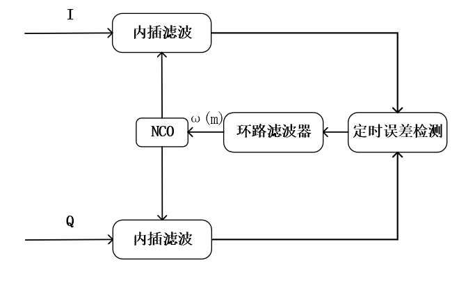

图4. Gardner环结构

###### NCO压控振荡器

在Gardner环中，NCO是一个相位递减单元，NCO寄存器的值每个时钟周期减小 $\omega(m)$ ，而当NCO寄存器的值递减到<0时，将其值+1，并输出一个`strobe_flag`信号代表最佳抽样判决点及最佳抽样判决点中间的点。正常情况下，最佳抽样判决点在符号的中间位置，但由于时钟偏差和收发端延时会有时间上的偏移，通过Gardner定时误差检测法来计算定时误差，通过环路滤波器后得到调整后的 $\omega(m)$ ，通过控制 $\omega(m)$ 即可调整NCO递减的速度，从而自适应地改变抽样判决点的位置。

###### 内插滤波器

内插滤波器依据输入的I路或Q路数据的相邻几个点来计算内插值，其输出数据的节拍和本地时钟同步，其中重要的输入参数为 $\mu_k$ ,代表分数间隔，在本设计中内插滤波器模块不断计算内插值，本设计采用Farrow结构的插值滤波器，为节省运算资源，其中的乘法运算通过移位操作和加法操作来完成。其输入输出关系为：

$$f_1=0.5x(m)-0.5x(m-1)-0.5x(m-2)+0.5x(m-3)$$

$$f_2=-0.5x(m)+1.5x(m-1)-0.5x(m-2)-0.5x(m-3)$$

$$f_3=x(m-2)$$

$$y(k)=f_1\mu_k^2+f_2\mu_k+f_3$$

###### Gardner定时误差检测器

Gardner定时误差检测算法是一种非数据辅助的误差检测算法，在该算法中，经过内插器内插后的信号符号需要采集两个点，一个点是最佳采样点，称为`strobe`，另一个是两个最佳采样点中间的点称为`midstrobe`，算法示意图如图5所示。

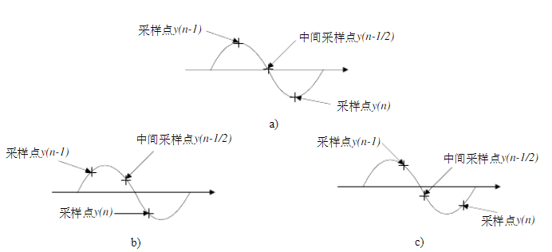

 图5. Gardner定时误差检测算法示意图

结合示意图，对于一路信号的定时误差的计算公式为：

$$\tau(n)=y(n-1/2)\times[y(n)-y(n-1)]$$

本设计中为了节省计算资源，使用峰值符号代替峰值，同时使用I、Q两路信号来计算定时误差，则误差公式修正为：

$$\tau(n)=\tau_I(n)+\tau_Q(n)$$

$$\tau_I(n)=y_I(n-1/2)\times[sign(y_I(n))-sign(y_I(n-1))]$$

$$\tau_Q(n) =y_Q(n-1/2)\times[sign(y_Q(n))-sign(y_Q(n-1))]$$

该式子具有明显的物理意义，即当两个采样点都位于符号中央时，中间采样数据为0，则输出误差为0。对于5(b)，本地时钟超前，定时误差为负值，而对于5(c)的情况，本地时钟滞后，定时误差为正值。所以Gardner定时误差检测算法可以确定定时误差的大小和方向，这一信息可以用于后续调整NCO的溢出频率，从而调整抽样判决点的位置。

###### 环路滤波器

Gardner环中的环路滤波器与Costas环中的环路滤波器结构相似,其结构如图6所示，实质上是一个IIR滤波器，作用是消除定时误差检测器输出的高频分量。

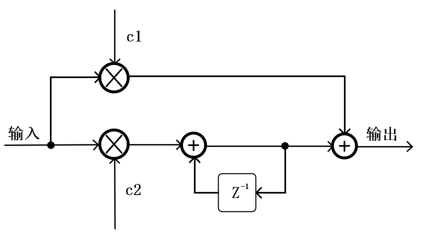

 图6. 二阶环路滤波器结构

为了在FPGA中用移位运算代替乘除运算并简化设计，环路滤波器的传递函数为：

$$H(z)=C_1+\frac{C_2Z^{-1}}{1-Z^{-1}}$$

$C_1$、 $C_2$ 的计算式子为：

$$C_1=\frac{8B_LT_s}{3}$$

$$C_2=\frac{32(B_LT_s)^2}{3}$$

其中， $B_LT_S$ 单边噪声带宽与采样周期的乘积，一般要求 $B_LT_S\leq 0.1$ ，在Gardner环路中，设定 $C_1=2^{-8}$ ， $C_2=0$ ，这样可以方便地使用移位操作来进行运算，节省了FPGA的运算资源。

##### 数据有效性检测

通过抽样判决得到抽判后IQ两路数据流后，需要将两路数据流重新组装成一路并行输出，接着设计一个数据有效性检测模块`data_valid`，捕获数据帧头，并计算、比对校验和，从而判定数据是否有效，当数据有效时输出到时钟数据显示模块，进行时钟数据的解析和显示。数据有效性检测模块`data_valid`的核心是移位寄存器，通过同步时钟标志，将串行数据流中的数据一位一位移到寄存器中，通过判断寄存器高位和低位是否出现帧头和有效校验和，来得知数据是否有效，当数据有效时输出数据有效标志并将寄存器存储的数据帧进行并行输出，得到并行输出数据。

### 仿真及实验部署

本设计已在[Xilinx Kintex-7](https://www.xilinx.com/products/silicon-devices/fpga/kintex-7.html) FPGA硬件平台上成功部署，在单个FPGA上实现了QPSK调制解调过程。硬件实验平台使用的是博宸精芯Kintex-7基础板开发板，芯片型号为XC7K325T-2FFG676，实验环境如图7所示。

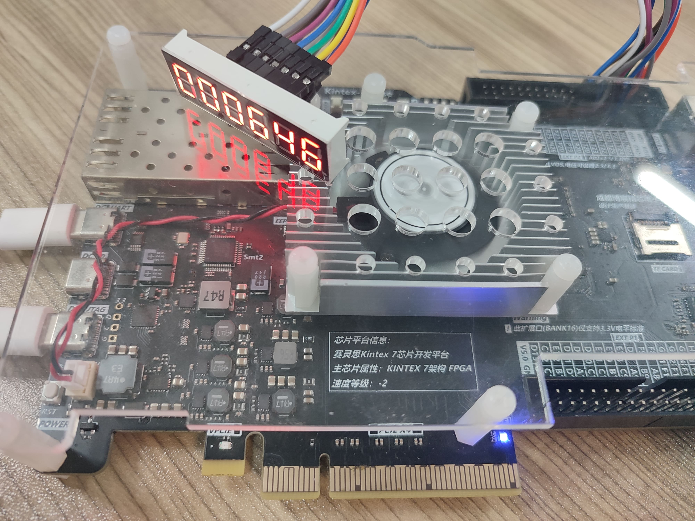

 图7. FPGA实验平台

从实际实验上看，在FPGA程序烧录后，时钟数据正常显示，演示视频参见[YouTube](https://youtu.be/pUp5kpjEX7Y)。

首先通过MATLAB跑通QPSK调制解调的基本流程，方便确定一些基本参数（如滤波器阶数等），详细MATLAB代码可见本工程所附文件夹。

完成QPSK调制解调的基本流程的实现后，编写了testbench文件对本设计的各个模块进行了仿真，仿真工具为Modelsim，以下分模块进行分析。

#### 数据生成模块仿真

本设计数据帧为40bit，如前所述，帧的头尾分别包含帧头和校验和，在Gardner环位同步技术中，连续的0或者连续的1会使得Gardner误差检测算法计算的定时误差为0，不利于进行位同步。为了使Gardner环方便进行位同步，IQ两路数据应该最好要有0\1交替的数据，故加入的帧头为8'b11001100，使得经过IQ分流后的两路数据都为1010。

对于仿真进行的初始时刻，仿真结果如图8所示，`dec_s`是秒值，`dec_m`是分钟值，`dec_h`是小时值，`para_o`是生成的40bit数据帧，从图中可见数据帧的帧头和校验和都生成正确，整个数据生成正确。

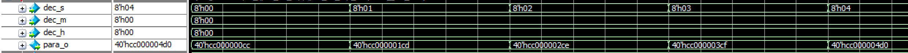

图8. clk_gen模块仿真结果

#### 调制模块仿真

对于QPSK_mod模块，首先要对数据进行并串转换，然后分出I、Q两路双极性信号，仿真结果如图9所示，`para_i`是生成的40bit数据帧，`ser_data`是并串转换后的串行数据输出，`I`、`Q`分别代表分流后的IQ两路双极性不归零码信号。从图9中结果可见，并串转换结果正确。

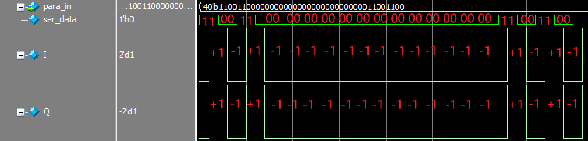

图9. 并串转换及双极性码转换仿真结果

将双极性不归零码通过平方根升余弦滤波器进行成形滤波，成形滤波前后的波形如图10所示。`I_filtered`和`Q_filtered`是成形滤波后，可见通过成形滤波后，原始信号的高频部分被滤除。

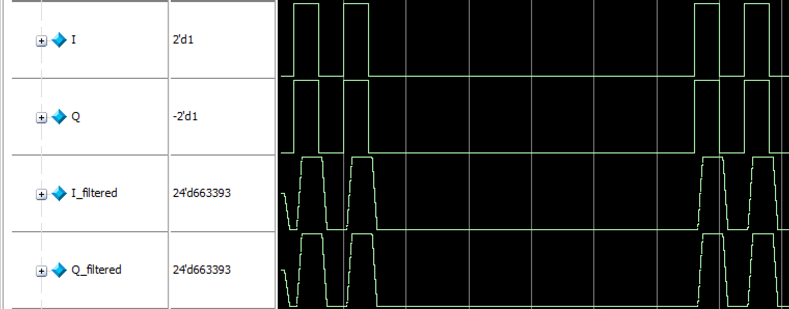

图10. 成形滤波仿真结果

通过DDS IP核生成正余弦载波，如图11所示，本设计中载波频率为50k，DDS相位更新周期500k，故一个载波周期具有10个采样点，仿真时间也符合预期设计。

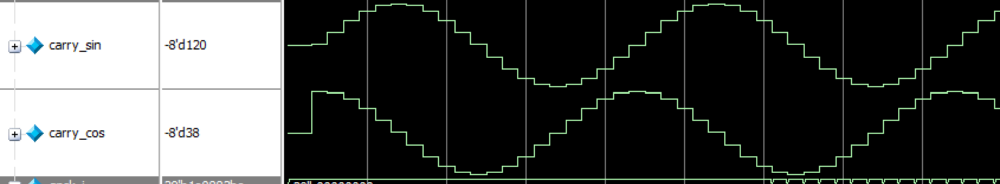

图11. 正余弦载波信号

将成形滤波后I路信号与余弦载波相乘，Q路信号与正弦载波相乘，进行数字上变频，仿真结果如图12所示，`qpsk_i`和`qpsk_q`分别是I、Q两路乘以对应载波之后的结果，从结果中可见相乘结果符合预期设计。

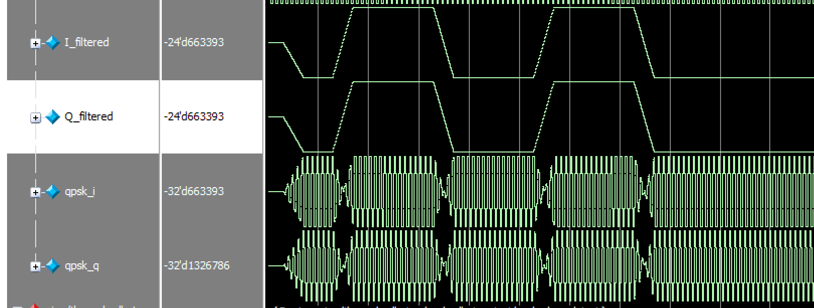

图12. 数字上变频仿真

将上变频后两路信号叠加，得到QPSK调制后信号，其与原始IQ两路双极性信号的比较如图13所示。QPSK信号随着数据流的变化，而发生了相位的改变，不过暂且无法通过直接观察得出调制成功的结论，需要结合解调端来进行验证。

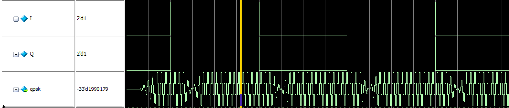

图13 QPSK调制结果

#### 解调模块仿真

在解调端，首先进行数字下变频，将QPSK信号乘以解调端本地正余弦载波，得到如图14所示的I、Q两路混频信号，其中`demo_I`代表I路，`demo_Q`代表Q路。将两路信号分别通过低通滤波器得到低频信号`filtered_I`以及`filtered_Q`，将两路信号与调制端原始的I、Q两路双极性信号比较。如图15所示，由图可见经过低通滤波后两路信号能反映原始I、Q两路码元的形状，符合预期。

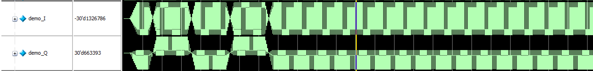

图14. 乘以本地载波后的I、Q两路信号

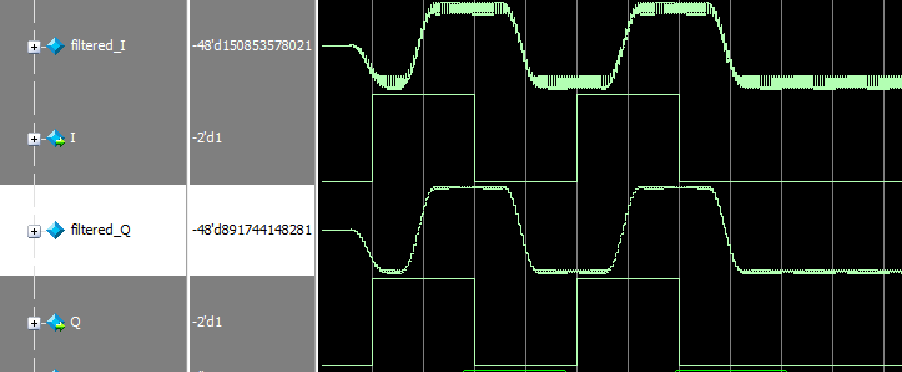

图15. 解调端通过低通滤波后的I、Q两路信号 vs.原始I、Q两路双极性信号

将经过滤波后的I、Q两路信号输入Gardner环中的内插滤波器，计算内插值，输出数据的波形如图16所示。其中`data_in_I`、`data_in_Q`分别是经过低通滤波后的I、Q两路数据，`I_y`、`Q_y`分别是内插滤波器输出的I、Q两路数据，从图16中结果可以看出，经过内插滤波器后的波形与原始波形稍有不同，但整体变化趋势一致，符合内插滤波按前后几个输入数据来计算输出数据的设定。

图16. Garnder环内插滤波器仿真结果

内插滤波器输出两路I、Q信号，交给定时误差检测模块进行定时误差检测，如图17所示，图中在`strobe_flag`来的时候采集数据，每个码元符号采集两次，并更新一次定时误差`error`的值。可见`strobe_flag`大致出现在码元符号的中间时刻以及码元变换边缘，符合预期。`wn`信号为环路滤波器的输出，也随着输入的定时误差的值的变化而变化。

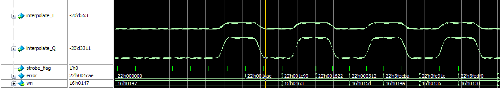

图17. 定时误差检测模块仿真结果

定时误差检测模块依据`strobe_flag`标志标定最佳抽样判决点，并输出抽样判决的数据，本设计中判决门限设置为0。输出的IQ两路同步数据如图18所示。`sync_out_I`和`sync_out_Q`为抽样判决后的同步输出数据，可见两路`sync_out_I`和`sync_out_Q`都在码元符号的中间时刻附近更新数据，符合最佳抽判点在符号中间位置的理论。

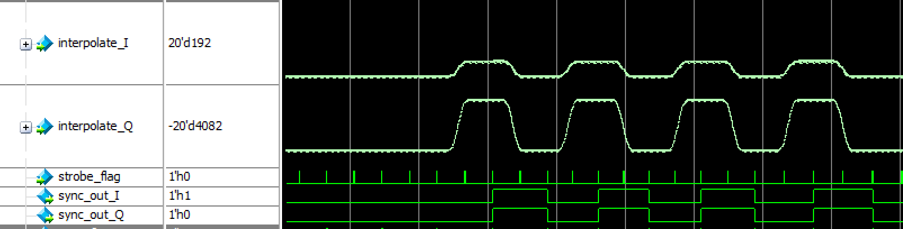

图18. 定时误差检测模块输出的抽样判决后的两路数据

Gardner环NCO寄存器的值每溢出一次，产生一个`strobe_flag`标志，为了判断NCO的溢出速度是否能随着定时误差的变化而动态，对NCO进行仿真，仿真结果如图19所示，从图中可见`strobe_flag`标志下降沿的间隔时间出现了变化，说明NCO的溢出速度有变化，可以起到动态调制最佳抽样判决点的作用。

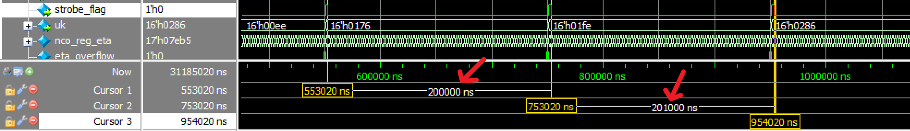

图19. Gardner NCO仿真结果

将定时误差检测模块得到的两路抽样判决后的同步数据`sync_out_I`和`sync_out_Q`进行合并，得到串行输出，并将其与调制端生成的串行输入数据进行对比，如图20所示，`ser_i`为调制端输入串行数据，`demo_ser_o`解调端输出的串行数据除了延时特性外具有一致性，初步判决解调结果正确。

图20. 调制端和解调端串行数据对比

数据有效性检测模块的仿真结果如图21所示，在检测到数据有效时`valid_flag`信号拉高，并输出此时移位寄存器里存储的有效数据值`valid_data_o`，从图中21可知，其与调制端数据生成模块`data_gen`生成的并行数据`para_data`是一致的，只是有一定时延，调制解调功能初步实现。

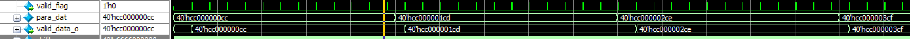

图21. 调制端和解调端并行数据对比

从顶层模块上看并行数据的产生和传输，如图22所示。可见，待传输的并行数据`para_dat`和最终解调得到的并行数据`para_out`是一致的，QPSK调制解调功能成功实现。

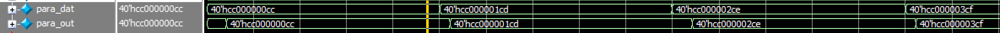

图22. 调制端和解调端并行数据对比

### 进展规划

- [x] 完成QPSK调制解调过程MATLAB仿真
- [x] 编写verilog实现QPSK调制解调基本过程
- [x] 实现QPSK解调端的Gardner位同步
- [x] 实现数字时钟数据生成和显示
- [x] 部署在单一FPGA硬件平台上，测试调制解调过程的正确性
- [ ] 实现costas环载波同步
- [ ] 加入噪声，仿真加噪后结果
- [ ] 新增mod branch和demod branch,将调制端和解调端分开，并在两台FPGA硬件设备上部署
- [ ] 编写blog，详细讲述本项目的实施细节和QPSK原理
